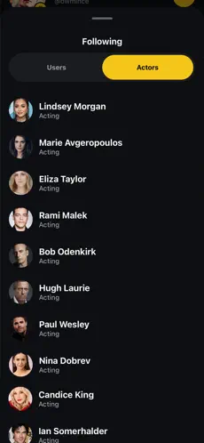
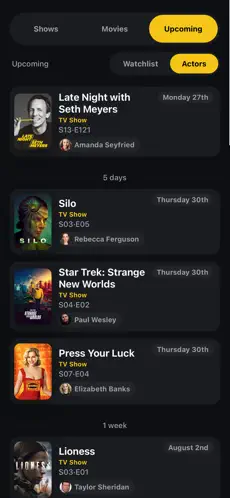

# References — TV Clone

## 1. Objetivo

As referências abaixo são prints reais do próprio TV Time (o produto original que estamos recriando), coletados antes do encerramento do app. Servem para justificar quais padrões de interface serão reaproveitados no MVP (descoberta, avaliação e listas) e quais foram conscientemente deixados de fora do escopo, conforme já registrado em `docs/requirements.md`.

## 2. Referência 01 — Busca de conteúdo

### Fonte
TV Time (app original, tela de busca)

### Imagem

### O que observamos?
A busca ("got") retorna uma lista única com filmes e séries misturados, cada card mostrando pôster, título, ano, tipo (TV Show/Movie), parte do elenco e a nota média em estrela. À direita de cada card há um botão de ação rápida: "+" para adicionar à lista, ou um check amarelo quando o título já foi adicionado.

### O que vamos aproveitar?
Resultado de busca único (filmes e séries juntos) com card compacto: pôster + título + ano + tipo + nota, e um botão de ação rápida de "adicionar" diretamente no card, sem precisar abrir os detalhes.

### Como será adaptado? (F01 — Descoberta)
Na página `SearchResults`, o `TitleCard` vai reaproveitar esse layout (pôster, título, ano, tipo, nota do TMDB) e ganhar um botão de ação rápida que abre o `ListPicker` direto no card, sem depender de entrar em `TitleDetails` primeiro.

## 3. Referência 02 — Perfil do usuário

### Fonte
TV Time (app original, tela de perfil)

### Imagem

### O que observamos?
O perfil abre com identidade (avatar, nome, @usuário, seguidores/seguindo), depois um bloco de estatísticas em destaque (tempo total assistido) e, abaixo, carrosséis "Recently Watched Series" e "Recently Watched Movies".

### O que vamos aproveitar?
A estrutura geral da página — um cabeçalho de identidade seguido de listas de atividade do usuário — para organizar a página `Profile`.

### Como será adaptado? (F02 — Avaliação)
Como estatísticas de tempo assistido e seguidores/seguindo estão fora do escopo do MVP (ver `requirements.md`, seção "Fora do Escopo"), a página `Profile` do TV Clone vai manter só a identidade simples do usuário local e, no lugar dos carrosséis de "assistido recentemente", vai listar as avaliações feitas (nota + comentário + link para o título), que é a informação que de fato guardamos.

## 4. Referência 03 — Listas (Watch List / In Progress / Completed)

### Fonte
TV Time (app original, tela principal de acompanhamento)

### Imagem

### O que observamos?
A tela principal separa o conteúdo em abas (Shows/Movies/Upcoming) e, dentro dela, sub-abas de lista (Watch List, In Progress, Completed). Cada item mostra progresso ("Caught up · S01-E04 in 3 days"), uma barra de progresso, episódios restantes e a nota do título.

### O que vamos aproveitar?
O conceito central de várias listas nomeadas (não só uma "watchlist" genérica) navegáveis por abas, cada uma mostrando quantos itens contém.

### Como será adaptado? (F03 — Listas personalizadas)
A página `Lists` vai adaptar essa ideia de abas para listas *criadas pelo próprio usuário* (em vez de fixas como "In Progress"/"Completed"), já que não fazemos acompanhamento de episódio a episódio. Cada lista mostra seus títulos com o mesmo card compacto da Referência 01, sem a barra de progresso de episódios (que depende de dado que não coletamos no MVP).

## 5. Referências observadas e deixadas fora do escopo

As três telas abaixo também foram analisadas, mas mostram funcionalidades que já decidimos não incluir no MVP — estão aqui para documentar que a decisão foi consciente, não por desconhecimento do produto original.

### Referência 04 — Lista de episódios por temporada

Mostra o controle de episódios assistidos, agrupado por temporada, com check individual por episódio. Não será replicado porque o MVP trata avaliação e listas no nível de título (filme/série), não de episódio — acompanhar episódio a episódio está listado em "Fora do Escopo".

### Referência 05 — Seguir atores

Mostra uma lista de atores seguidos pelo usuário. Não será replicado porque comunidade/seguir pessoas ou atores está listado em "Fora do Escopo" do MVP.

### Referência 06 — Lançamentos futuros (Upcoming)

Mostra um calendário de próximos episódios/lançamentos agrupado por data, com informações de elenco. Não será replicado porque notificações de lançamento e calendário estão listados em "Fora do Escopo" do MVP.
