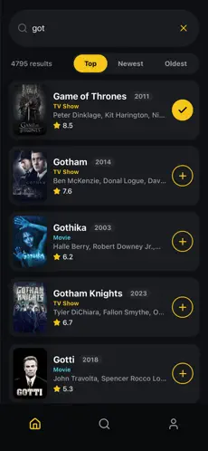
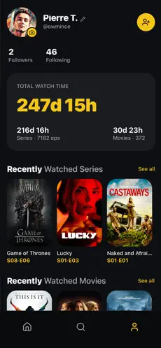
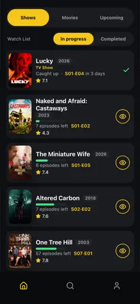
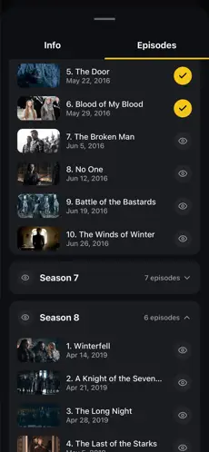
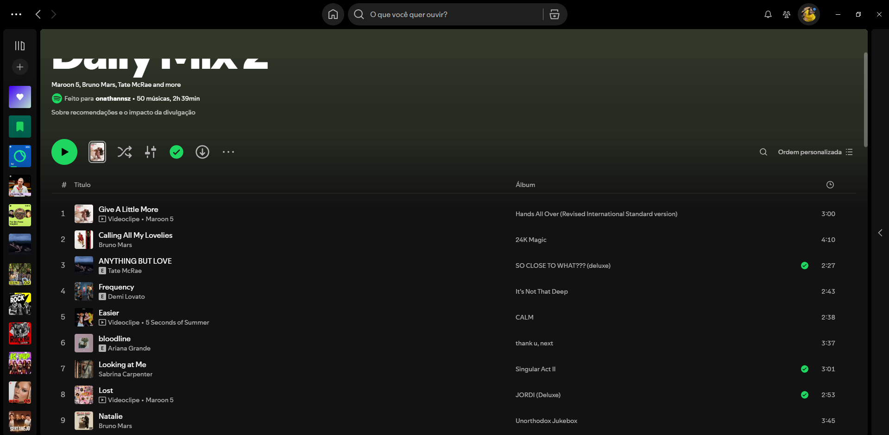
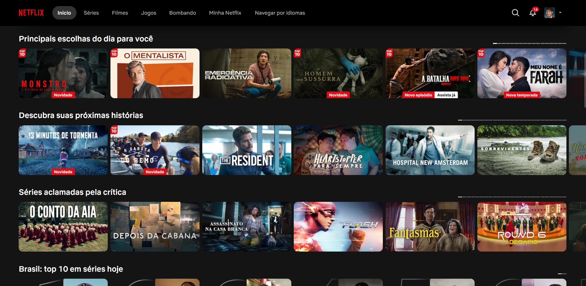

# References — TV Clone

## 1. Objetivo

As quatro primeiras referências são prints reais do próprio TV Time (o produto original que estamos recriando), coletados antes do encerramento do app, e justificam os padrões de interface reaproveitados no MVP (descoberta, avaliação e listas). As duas últimas vêm de fora do universo de filmes e séries — Spotify e Netflix — e sustentam decisões visuais e de movimento da aplicação.

## 2. Referência 01 — Busca de conteúdo

### Fonte
TV Time (app original, tela de busca)

### Imagem

### O que observamos?
A busca ("got") retorna uma lista única com filmes e séries misturados, cada card mostrando pôster, título, ano, tipo (TV Show/Movie), parte do elenco e a nota média em estrela. À direita de cada card há um botão de ação rápida: "+" para adicionar à lista, ou um check amarelo quando o título já foi adicionado.

### O que vamos aproveitar?
Resultado de busca único (filmes e séries juntos) com card compacto: pôster + título + ano + tipo + nota, e um botão de ação rápida de "adicionar" diretamente no card, sem precisar abrir os detalhes.

### Como será adaptado? (F01 — Descoberta)
O `TitleCard` reaproveita esse layout na Home e em `SearchResults` (pôster, título, ano, tipo e nota do TMDB) e tem o mesmo botão de ação rápida: um "+" que adiciona o título à lista "Quero assistir" e vira um check quando ele já está lá, exatamente como na referência. O botão também desfaz a ação: clicando de novo o título sai da lista, e o ícone vira um "X" ao passar o mouse para deixar isso claro.

Duas diferenças conscientes em relação ao print: o elenco **não** aparece no card, porque os endpoints de busca e de populares do TMDB não retornam elenco — buscá-lo exigiria uma requisição extra por card, então o elenco ficou só na página de detalhes (onde já vem junto com o resto). E o "+" adiciona direto na lista padrão em vez de abrir um seletor; escolher entre várias listas acontece no `ListPicker`, dentro dos detalhes.

## 3. Referência 02 — Perfil do usuário

### Fonte
TV Time (app original, tela de perfil)

### Imagem

### O que observamos?
O perfil abre com identidade (avatar, nome, @usuário, seguidores/seguindo), depois um bloco de estatísticas em destaque (tempo total assistido) e, abaixo, carrosséis "Recently Watched Series" e "Recently Watched Movies".

### O que vamos aproveitar?
A estrutura geral da página — um cabeçalho de identidade seguido de listas de atividade do usuário — para organizar a página `Profile`.

### Como será adaptado? (F02 — Avaliação)
Como estatísticas de tempo assistido e seguidores/seguindo estão fora do escopo do MVP (ver `requirements.md`, seção "Fora do Escopo"), a página `Profile` do TV Clone vai manter só a identidade simples do usuário local e, no lugar dos carrosséis de "assistido recentemente", vai listar as avaliações feitas (nota + comentário + link para o título), que é a informação que de fato guardamos.

## 4. Referência 03 — Listas (Watch List / In Progress / Completed)

### Fonte
TV Time (app original, tela principal de acompanhamento)

### Imagem

### O que observamos?
A tela principal separa o conteúdo em abas (Shows/Movies/Upcoming) e, dentro dela, sub-abas de lista (Watch List, In Progress, Completed). Cada item mostra progresso ("Caught up · S01-E04 in 3 days"), uma barra de progresso, episódios restantes e a nota do título.

### O que vamos aproveitar?
O conceito central de várias listas nomeadas (não só uma "watchlist" genérica) navegáveis por abas, cada uma mostrando quantos itens contém.

### Como será adaptado? (F03 — Listas personalizadas)
A página `Lists` vai adaptar essa ideia de abas para listas *criadas pelo próprio usuário* (em vez de fixas como "In Progress"/"Completed"), já que não fazemos acompanhamento de episódio a episódio. Cada lista mostra seus títulos com o mesmo card compacto da Referência 01, sem a barra de progresso de episódios (que depende de dado que não coletamos no MVP).

## 5. Referência 04 — Episódios por temporada

### Fonte
TV Time (app original, tela de episódios de uma série)

### Imagem

### O que observamos?
Os episódios aparecem agrupados por temporada, em blocos que abrem e fecham. Cada linha traz a miniatura da cena, o número e o nome do episódio e a data de exibição; à direita, um controle marca se o episódio já foi assistido (check amarelo) ou não (ícone de olho).

### O que vamos aproveitar?
O agrupamento por temporada em blocos retráteis e o formato da linha do episódio: miniatura + número, nome e data.

### Como foi adaptado? (F05 — Lista de episódios)
Na página de uma série, o componente `EpisodeList` lista as temporadas com a contagem de episódios e o ano; a primeira já vem aberta e abrir outra fecha a anterior. Os episódios de cada temporada são buscados só quando ela é aberta (`/tv/:id/season/:numero`), então uma série com 8 temporadas não custa 8 requisições ao entrar na página. Cada linha mostra miniatura, número, nome, data em formato brasileiro e a nota do TMDB.

O controle de "assistido" também foi reaproveitado: cada episódio tem um botão que alterna entre o check (assistido) e o olho (não assistido), como no print, e o estado fica salvo no navegador. Em cima disso, o cabeçalho da temporada mostra o progresso ("2/10 assistidos"), que no app original aparece na tela de acompanhamento (Referência 03).

Uma informação a mais em relação ao print: a nota do episódio no TMDB, que já vem na mesma requisição dos episódios.

## 6. Padrão presente nas três referências — navegação inferior

As telas de busca, perfil e acompanhamento (Referências 01, 02 e 03) têm em comum uma barra de navegação fixa no rodapé, com poucos itens representados por ícone + rótulo e o item atual destacado em amarelo.

**Como foi adaptado:** no celular, os links de navegação saem do topo e viram o componente `BottomNav`, fixo na parte de baixo da tela, com Início, Listas e Perfil — a mesma lógica de ícone + rótulo e destaque do item ativo. Como o TV Clone é uma plataforma web (e não um app), a partir de telas maiores essa barra desaparece e a navegação volta para o `Header`, que é o padrão esperado no desktop. O campo de busca fica no `Header` nos dois tamanhos, em vez de ocupar um item da barra inferior como no app original.

## 7. Referência 07 — Spotify (fundo colorido no topo)

### Fonte
Spotify web player, tela de uma playlist (ex.: "Release Radar").

### Imagem

### O que observamos?
O topo da página ganha um fundo na cor dominante da capa, que vai perdendo intensidade até se fundir com o fundo escuro do app. Isso dá identidade visual para cada playlist sem precisar de nenhum elemento novo na interface.

### O que vamos aproveitar?
A ideia de tingir o topo da página com a cor do próprio conteúdo, em vez de usar sempre o mesmo fundo neutro.

### Como foi adaptado? (F01/F02 — página de detalhes)
Na página de detalhes, o componente `TitleBackdrop` usa o banner do título (`backdrop_path` do TMDB) bem desfocado, com saturação e brilho aumentados, e um degradê por cima que fecha na cor de fundo do app. O resultado é o mesmo do Spotify — cada filme ou série tem seu próprio tom no topo — só que a cor vem da imagem em vez de uma paleta extraída.

Consequência conhecida: títulos com banner escuro (Game of Thrones, por exemplo) rendem um tom bem discreto. O Spotify tem o mesmo comportamento com capas escuras, então mantivemos assim em vez de forçar uma cor artificial.

## 8. Referência 08 — Netflix (transição das imagens entre telas)

### Fonte
Netflix web, tela inicial.

### Imagem

### O que observamos?
A home é formada por trilhos horizontais em que a arte do título é praticamente o único elemento do card. Ao abrir um título, é essa mesma arte que cresce e vira o topo da tela de detalhes: a imagem funciona como fio condutor entre as duas telas, em vez de uma troca seca de página.

### O que vamos aproveitar?
Usar a imagem do próprio título como elo entre a listagem e os detalhes, para o usuário não perder de vista o que ele acabou de clicar.

### Como foi adaptado? (F01 — Descoberta)
O TV Clone usa a View Transitions API: o pôster do `TitleCard` e o pôster da página de detalhes compartilham o mesmo `view-transition-name`, então a imagem cresce de um lugar para o outro em vez de sumir e reaparecer. A transição é ligada pelo `viewTransition` dos links do React Router, e o `useViewTransitionState` garante que só o card clicado entre na animação — se todos os cards da página entrassem, o navegador precisaria fotografar os 40 de uma vez.

Duas decisões de implementação que a referência exigiu:

- O card manda o resumo do título junto na navegação (`state`), porque sem isso a página de detalhes ainda estaria no skeleton quando a animação começa — e sem imagem do outro lado não existe transição, só um desaparecimento.
- Quem prefere menos animação no sistema (`prefers-reduced-motion`) não vê nenhuma delas.

Diferença em relação ao print: na Netflix o card é só a arte em formato paisagem; aqui o card também carrega título, ano, tipo e nota (herdados da Referência 01, do próprio TV Time), então o que viaja entre as telas é o pôster em retrato.
